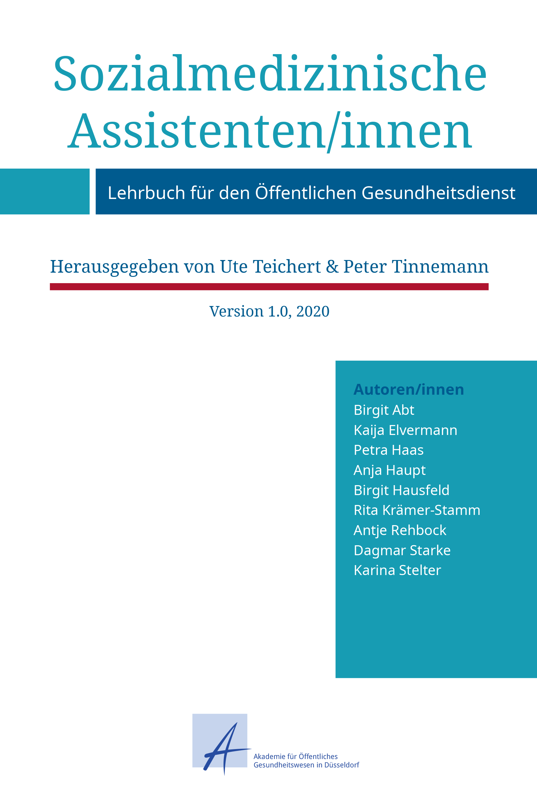

{:.imgcover}
*Sozialmedizinische Assistenten/innen - Lehrbuch für den Öffentlichen Gesundheitsdienst*

Sozialmedizinische Assistentinnen und Assistenten (SMA) sind Fachkräften
der Gesundheitsämter. Sie arbeiten z.B. in der Gesundheitsförderung,
Prävention und Gesundheitshilfe, wirken bei Einschulungsuntersuchungen
mit, beraten über gesundheitliche Risiken und Maßnahmen zur Prävention,
unterstützen bei der Untersuchung von Infektionskrankheiten und
Impfungen oder machen Hausbesuche bei Familien mit Kindern oder Menschen
in besonderen Lebenslagen.

Damit Ihre Unterstützung von Ärztinnen und Ärzte eine hohe Relevanz
erhält, und in Zukunft zu einem noch wichtigeren Tätigkeitsfeld im
Öffentlichen Gesundheitsdienstes werden kann, benötigen SMA das
notwendige Rüstzeug im Rahmen einer fundierten Ausbildung.

**Dieses Lehrbuch soll SMA in Gesundheitsämtern, aber auch aus anderen
Einrichtungen des ÖGD, Grundlegenden Prinzipien und Methoden, sowie
praktische Erfahrungen vermitteln damit diese sich zielgerecht auf die
Arbeiten vorbereiten können.**

Daher vermittelt es rechtliche Grundlagen u.a. aus dem Sozialgesetzbuch,
Infektionsschutzgesetz, Kinderschutzgesetz und zum Datenschutz, es
stellt die Grundlagen der Lehre über die Krankheiten und deren Ursachen,
Grundlagen der Statistik, der Kommunikation sowie Gesundheitsförderung
und Prävention dar. 

Die Inhalte dieses Lehrbuch befähigen SMA für Ihre besonderen
sozialkompensatorischen Aufgaben im Öffentlichen und stellt die Basis
für die theoretische Weiterbildung der SMA an der Akademie für
Öffentliches Gesundheitswesen dar. Die in diesem einzigartigen Lehrbuch
zusammengefassten Inhalte beruhen auf jahrelanger theoretischer
Auseinandersetzung und praktischer Erfahrung der Autoren/innen im ÖGD.
**Das vorliegende Lehrbuch ist ein Gemeinschaftswerk aller beteiligten
Autorinnen und Autoren und ist nicht die Meinung einzelner Institutionen
oder einzelner Autoren und Autorinnen.**

Es wird zukünftig aktualisiert und erweitert werden. Wir freuen uns
daher, wenn Sie uns Ihre Anregungen, Kommentare und Ergänzungen
mitteilen. Schicken Sie diese bitte an lehrbuch@akademie-oegw.de

Wir nutzen **[Hypothes.is](https://hypothes.is/ "https://hypothes.is/")** für Ihre
Kommentare und Ergänzungen unseres Lehrbuches.
